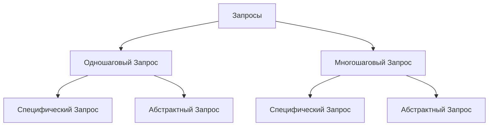
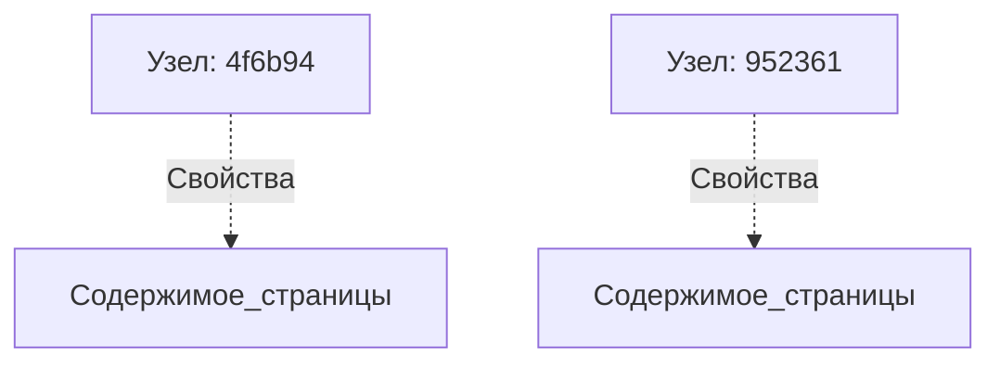
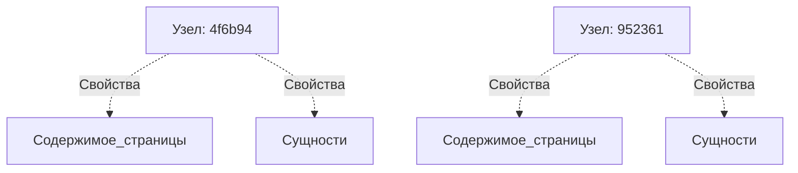
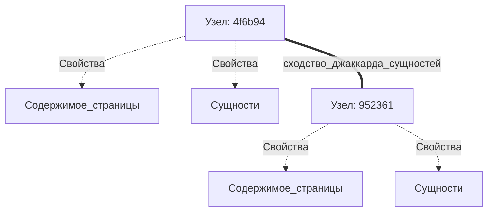

# Генерация тестового набора для **RAG** (**R**etrieval-**A**ugmented **G**eneration)

В приложении **RAG**, когда пользователь взаимодействует через ваше приложение с набором документов, могут встречаться различные паттерны запросов. Сначала давайте разберемся, какие типы запросов могут возникать в приложении **RAG**.

## Типы запросов в **RAG**



### **Single-Hop Query** (Одношаговый Запрос)

**Single-Hop Query** — это прямой вопрос, который требует извлечения информации из одного документа или источника для предоставления релевантного ответа. Для получения ответа требуется всего один шаг.

**Пример (Specific Query / Специфический Запрос):**

  - «В каком году **Albert Einstein** опубликовал теорию относительности?»

Это специфический, основанный на фактах вопрос, на который можно ответить с помощью одного извлечения из документа, содержащего эту информацию.

**Пример (Abstract Query / Абстрактный Запрос):**

  - «Как теория **Einstein**'а изменила наше понимание времени и пространства?»

Хотя этот запрос по-прежнему относится к одному понятию (теория относительности), он требует более абстрактного или интерпретирующего объяснения из исходного материала.

### **Multi-Hop Query** (Многошаговый Запрос)

**Multi-Hop Query** включает несколько шагов рассуждения, требуя информации из двух или более источников. Система должна извлечь информацию из различных документов и связать эти данные, чтобы сгенерировать точный ответ.

**Пример (Specific Query / Специфический Запрос):**

  - «Какой ученый повлиял на работу **Einstein**'а по теории относительности, и какую теорию он предложил?»

Это требует от системы извлечения информации как об ученом, повлиявшем на **Einstein**'а, так и о конкретной теории, возможно, из двух разных источников.

**Пример (Abstract Query / Абстрактный Запрос):**

  - «Как развивались научные теории относительности с момента оригинальной публикации **Einstein**'а?»

Этот абстрактный запрос требует извлечения множества фрагментов информации с течением времени и из разных источников для формирования широкого, интерпретирующего ответа об эволюции теории.

### **Specific** (Специфические) в сравнении с **Abstract Queries** (Абстрактными Запросами) в **RAG**

  - **Specific Query**: Сосредоточен на четком, основанном на фактах извлечении. Цель в **RAG** — извлечь высокорелевантную информацию из одного или нескольких документов, которая напрямую отвечает на конкретный вопрос.

  - **Abstract Query**: Требует более широкого, более интерпретирующего ответа. В **RAG** абстрактные запросы ставят перед системой извлечения задачу получить информацию из документов, содержащих рассуждения, объяснения или мнения более высокого уровня, а не простые факты.

Как в одношаговых, так и в многошаговых случаях, различие между специфическими и абстрактными запросами формирует процесс извлечения и генерации, определяя, направлен ли фокус на **точность** (specific) или на **синтез более широких идей** (abstract).

Различные типы запросов требуют синтеза различных контекстов. Для решения этой проблемы **Ragas** использует подход к **Test set Generation** (Генерации тестового набора), основанный на **Knowledge Graph** (Графе знаний).

-----

## **Knowledge Graph Creation** (Создание Графа Знаний)

Учитывая, что мы хотим создать различные типы запросов из заданного набора документов, нашей основной задачей является определение правильного набора фрагментов (chunks) или документов, чтобы дать возможность **LLM** (Large Language Models) создавать запросы. Для решения этой проблемы **Ragas** использует подход к **Test set Generation**, основанный на **Knowledge Graph**.

\<figure markdown="span"\>
{width="auto"}
\<figcaption\>Создание графа знаний\</figcaption\>
\</figure\>

**Knowledge Graph** создается с использованием следующих компонентов:

### **Document Splitter** (Разделитель Документов)

Документы разбиваются на фрагменты, формируя иерархические узлы (**nodes**). Разделение на фрагменты может быть выполнено с использованием различных разделителей. Например, в случае финансовых документов разделение на фрагменты может быть выполнено с использованием разделителя, который разбивает документ на основе разделов, таких как **Income Statement** (Отчет о прибылях и убытках), **Balance Sheet** (Бухгалтерский баланс), **Cash Flow Statement** (Отчет о движении денежных средств) и т. д. Вы можете написать свои собственные [**custom splitters** (пользовательские разделители)](https://www.google.com/search?q=), чтобы разделить документ на основе разделов, которые относятся к вашей предметной области.

#### Пример

```python
from ragas.testset.graph import Node

sample_nodes = [Node(
    properties={"page_content": "Теория относительности Эйнштейна произвела революцию в нашем понимании пространства и времени. Она ввела концепцию, что время не является абсолютным, а может меняться в зависимости от системы отсчета наблюдателя."}
),Node(
    properties={"page_content": "Замедление времени происходит, когда объект движется со скоростью, близкой к скорости света, в результате чего время течет медленнее относительно стационарного наблюдателя. Это явление является ключевым предсказанием специальной теории относительности Эйнштейна."}
)]
sample_nodes
```

Вывод:

```bash
[Node(id: 4f6b94, type: , properties: ['page_content']),
 Node(id: 952361, type: , properties: ['page_content'])]
```



### **Extractors** (Извлекатели)

Различные **extractors** используются для извлечения информации из каждого узла (**node**), которая может быть использована для установления отношения между узлами. Например, в случае финансовых документов могут использоваться **extractor** для извлечения сущностей (**entities**) (например, **Company Name** / Название компании), **Keyphrase extractor** (Извлекатель ключевых фраз) для извлечения важных ключевых фраз, присутствующих в каждом узле, и т. д. Вы можете написать свои собственные **custom extractors** (пользовательские извлекатели), чтобы извлекать информацию, которая имеет отношение к вашей предметной области.

**Extractors** могут быть основаны на **LLM**, которые наследуются от `LLMBasedExtractor`, или основаны на правилах, которые наследуются от `Extractor`.

#### Пример

Допустим, у нас есть пример узла (**sample node**) из **Knowledge Graph**. Мы можем использовать `NERExtractor` для извлечения именованных сущностей (**named entities**) из узла.

```python
from ragas.testset.transforms.extractors import NERExtractor

extractor = NERExtractor()
output = [await extractor.extract(node) for node in sample_nodes]
output[0]
```

Возвращает кортеж типа **extractor** и извлеченной информации.

```bash
('entities', ['Einstein', 'theory of relativity', 'space', 'time', "observer's frame of reference"])
```

Добавим извлеченную информацию в узел.

```python
_ = [node.properties.update({key:val}) for (key,val), node in zip(output, sample_nodes)]
sample_nodes[0].properties
```

Вывод:

```bash
{'page_content': "Теория относительности Эйнштейна произвела революцию в нашем понимании пространства и времени. Она ввела концепцию, что время не является абсолютным, а может меняться в зависимости от системы отсчета наблюдателя.", 
'entities': ['Einstein', 'theory of relativity', 'space', 'time', 'observer']}
```



### **Relationship builder** (Построитель Отношений)

Извлеченная информация используется для установления отношения между узлами. Например, в случае финансовых документов отношение может быть установлено между узлами на основе сущностей (**entities**), присутствующих в узлах. Вы можете написать свой собственный [**custom relationship builder** (пользовательский построитель отношений)](https://www.google.com/search?q=), чтобы установить отношение между узлами на основе информации, которая имеет отношение к вашей предметной области.

#### Пример

```python
from ragas.testset.graph import KnowledgeGraph
from ragas.testset.transforms.relationship_builders.traditional import JaccardSimilarityBuilder

kg = KnowledgeGraph(nodes=sample_nodes)
rel_builder = JaccardSimilarityBuilder(property_name="entities", key_name="PER", new_property_name="entity_jaccard_similarity")
relationships = await rel_builder.transform(kg)
relationships
```

Вывод:

```bash
[Relationship(Node(id: 4f6b94) <-> Node(id: 952361), type: jaccard_similarity, properties: ['entity_jaccard_similarity'])]
```

Поскольку оба узла имеют одну и ту же сущность "**Einstein**", отношение устанавливается между узлами на основе сходства сущностей.



Теперь давайте разберемся, как построить **Knowledge Graph** с использованием вышеуказанных компонентов с помощью **transform** (преобразования), что упростит вашу работу.

### **Transforms** (Преобразования)

Все компоненты, используемые для построения **Knowledge Graph**, могут быть объединены в единое **transform**, которое может быть применено к **Knowledge Graph** для его построения. **Transforms** состоит из списка компонентов, которые применяются к **Knowledge Graph** последовательно. Он также может обрабатывать параллельную обработку компонентов. Метод `apply_transforms` используется для применения **transforms** к **Knowledge Graph**.

#### Пример

Давайте построим вышеупомянутый **Knowledge Graph** с использованием вышеуказанных компонентов с помощью **transform**.

```python
from ragas.testset.transforms import apply_transforms
transforms = [
    extractor,
    rel_builder
    ]

apply_transforms(kg,transforms)
```

Чтобы применить некоторые компоненты параллельно, вы можете обернуть их в класс `Parallel`.

```python
from ragas.testset.transforms import KeyphraseExtractor, NERExtractor
from ragas.testset.transforms import apply_transforms, Parallel

tranforms = [
    Parallel(
        KeyphraseExtractor(),
        NERExtractor()
    ),
    rel_builder
]

apply_transforms(kg,transforms)
```

Как только **Knowledge Graph** создан, различные типы запросов могут быть сгенерированы путем обхода графа. Например, чтобы сгенерировать запрос «Сравните рост выручки Компании X и Компании Y с 2020 по 2023 финансовый год», граф может быть обойден для поиска узлов, которые содержат информацию о росте выручки Компании X и Компании Y с 2020 по 2023 финансовый год.

-----

## **Scenario Generation** (Генерация Сценариев)

Теперь у нас есть **Knowledge Graph**, который можно использовать для создания правильного контекста для генерации любого типа запроса. Когда совокупность пользователей взаимодействует с системой **RAG**, они могут формулировать запросы по-разному в зависимости от их **persona** (персонажа) (например, **Senior Engineer** / Старший инженер, **Junior Engineer** / Младший инженер и т. д.), **Query length** (длины запроса) (Short / Короткий, Long / Длинный и т. д.), **Query style** (стиля запроса) (Formal / Формальный, Informal / Неформальный и т. д.). Чтобы генерировать запросы, которые охватывают все эти сценарии, **Ragas** использует подход к **Test set Generation**, основанный на **Scenario** (Сценариях).

Каждый **Scenario** в **Test set Generation** представляет собой комбинацию следующих параметров.

  - **Nodes** (Узлы): Узлы, которые используются для генерации запроса
  - **Query Length** (Длина Запроса): Длина желаемого запроса, она может быть **short** (короткой), **medium** (средней) или **long** (длинной) и т. д.
  - **Query Style** (Стиль Запроса): Стиль запроса, это может быть **web search** (веб-поиск), **chat** (чат) и т. д.
  - **Persona** (Персона): Персона пользователя, это может быть **Senior Engineer** (Старший инженер), **Junior Engineer** (Младший инженер) и т. д. (Скоро)

\<figure markdown="span"\>
{width="auto"}
\<figcaption\>Сценарий в Генерации Тестового Набора\</figcaption\>
\</figure\>

### **Query Synthesizer** (Синтезатор Запросов)

`QuerySynthesizer` отвечает за генерацию различных **scenarios** для одного типа запроса. Метод `generate_scenarios` используется для генерации **scenarios** для одного типа запроса. Метод `generate_sample` используется для генерации запроса и эталонного ответа для одного **scenario**. Давайте разберемся в этом на примере.

#### Пример

В предыдущем примере мы создали **Knowledge Graph**, который содержит два узла, связанных друг с другом на основе сходства сущностей. Теперь представьте, что в вашем **KG** (Knowledge Graph) есть 20 таких пар узлов, которые связаны друг с другом на основе сходства сущностей.

Представьте, что ваша цель — создать 50 различных запросов, где каждый запрос представляет собой некий абстрактный вопрос, сравнивающий две сущности. Сначала мы должны запросить **KG**, чтобы получить пары узлов, связанных друг с другом на основе сходства сущностей. Затем мы должны сгенерировать **scenarios** для каждой пары узлов, пока не получим 50 различных **scenarios**. Эта логика реализована в методе `_generate_scenarios`.

```python
from dataclasses import dataclass
from ragas.testset.synthesizers.base_query import QuerySynthesizer

@dataclass
class EntityQuerySynthesizer(QuerySynthesizer):

    async def _generate_scenarios( self, n, knowledge_graph, callbacks):
        """
        Логика для запроса узлов с сущностью
        Логика, описывающая, как объединить узлы, стили, длину, персону, чтобы сформировать n сценариев
        """

        return scenarios

    async def _generate_sample(
        self, scenario, callbacks
    ):

        """
        Логика использования преобразования каждого сценария в EvalSample (Запрос, Контекст, Ссылка)
        Вы можете создать одношаговый или многошаговый образец
        """

        return SingleTurnSample(user_input=query, reference_contexs=contexts, reference=reference)
```